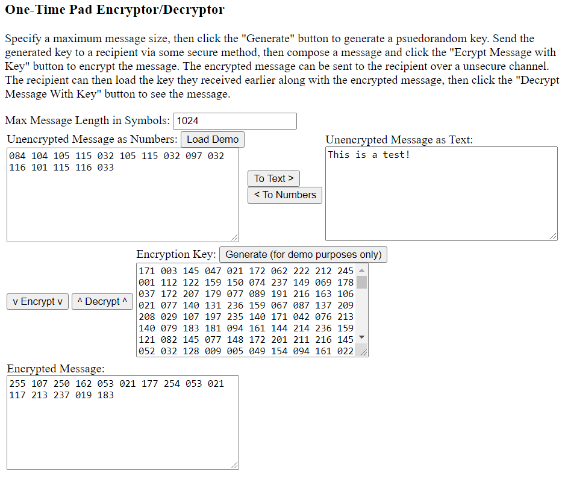

EncryptorDecryptorOneTimePad
============================

The code in this repository, when run, allows the user to specify an encryption key composed of random numbers and a message to be decrypted or encrypted.  The message can then be decrypted or encrypted.

